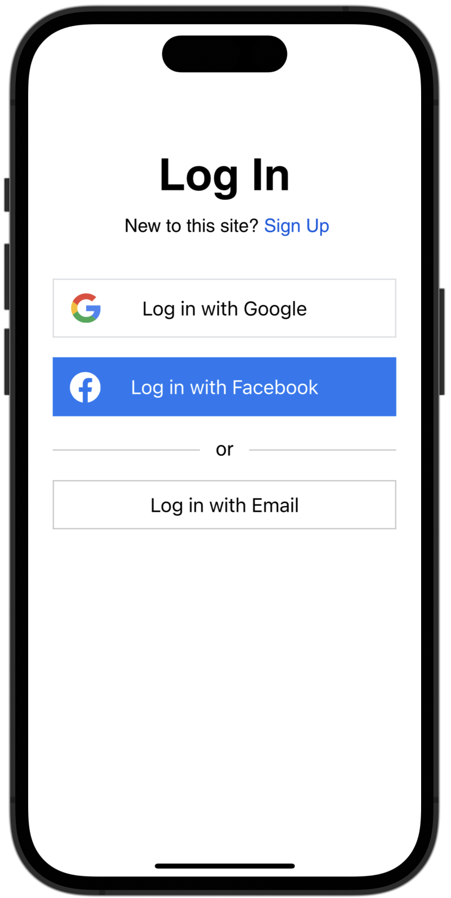
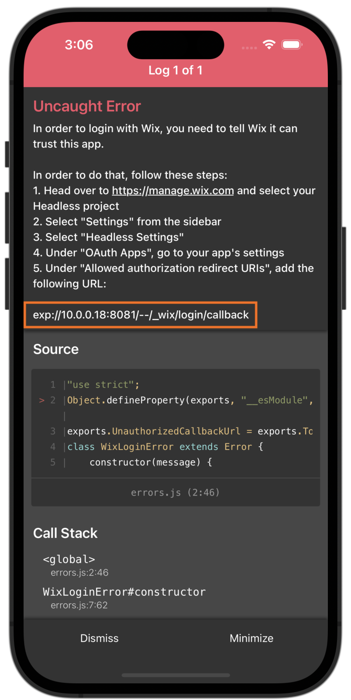
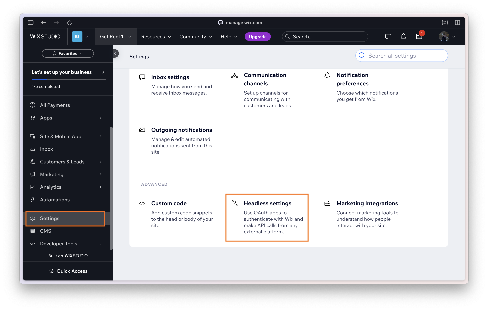
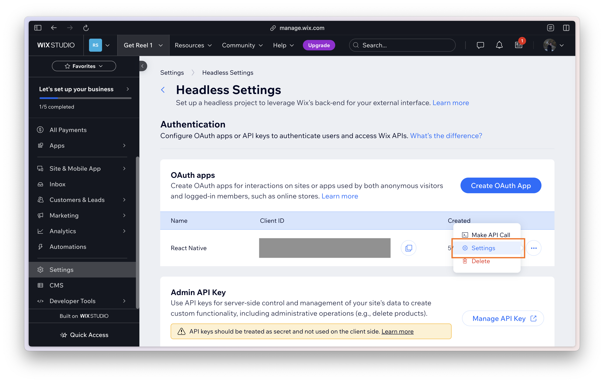
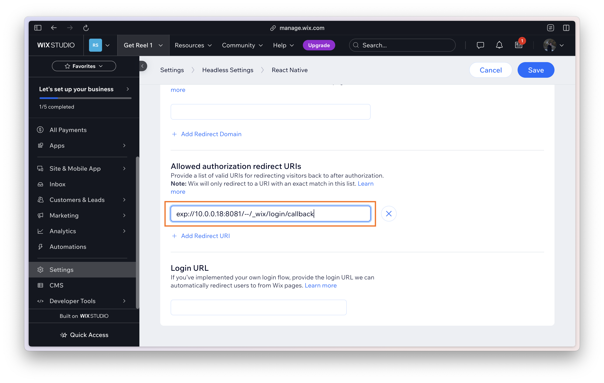

# wix-login-react-native

This is a React Native component that encapsulates Wix's "Managed Login" flow, allowing users to integrate it seamlessly into their app. By using the `<WixLogin />` component at the root of your app, you get a login modal that you can open from anywhere in your app, and calls a callback when the user is fully logged in.

For more information about Wix's Managed Login Flow, head over to the [Wix Headless documentation](https://dev.wix.com/docs/go-headless/coding/java-script-sdk/visitors-and-members/handle-members-with-wix-managed-login).

<p align="center">



</p>

## Installation

Ensure that your React Native project has the following dependencies installed:
1. `react` and `react-native`
2. `@wix/sdk` ([documentation](https://dev.wix.com/docs/sdk/core-modules/sdk/introduction))
3. `expo-crypto` ([documentation](https://docs.expo.dev/versions/latest/sdk/crypto/))
4. `expo-linking` ([documentation](https://docs.expo.dev/guides/linking/))
5. `react-native-webview` ([documentation](https://docs.expo.dev/versions/latest/sdk/webview/))

> **Note:** These dependencies need to be installed and linked only once in your React Native project.

Then, install this package using the following command:
```sh
npm install wix-login-react-native
# or
yarn add wix-login-react-native
```

## Usage

First, add the `<WixLogin />` component to the root of your application. Provide the component with two props:

1.  A Wix Client created using createClient(...) and the OAuthStrategy auth option.
2.	A callback function that accepts the user tokens (credentials) once the user is logged in.

```jsx
import { WixLogin } from 'wix-login-react-native';
import { createClient, OAuthStrategy } from '@wix/sdk';

const client = createClient({ auth: OAuthStrategy({ clientId: '<YOUR_CLIENT_ID>' }) });

const App = () => (
  <WixLogin
    client={client}
    onLoginComplete={tokens => client.auth.setTokens(tokens)}
  />
);

export default App;
```

Then, from anywhere in your app, import the `useWixLogin` hook. When you want to prompt the user to login, just run:

```jsx
import { useWixLogin } from 'wix-login-react-native';

const SomeComponent = () => {
  const wixLogin = useWixLogin();
  
  const handleLogin = () => {
    wixLogin.openLoginModal();
  };

  return (
    <Button title="Login" onPress={handleLogin} />
  );
};
```

### Authorizing your app with Wix
The first time you open the login modal, it may throw an error because you need to configure Wix to trust your app:

<p align="center">



</p>

In order to make Wix trust your app, go to https://manage.wix.com and choose your Headless project.

From there, go to Settings > Headless Settings:


Choose your OAuth App:


And under "Allowed authorization redirect URIs", add the URL provided to you from the error message:


> **⚠️ Important**: If you’re using Expo Go, the trusted “callback URL” will change once you build your own binary, so make sure to register the production version of your callback URL before you release your app.